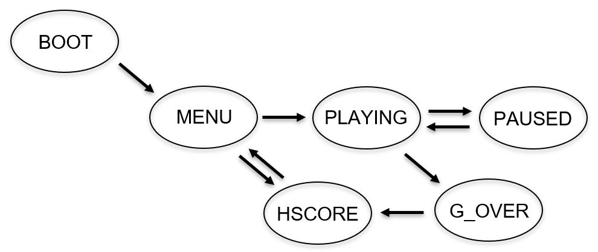

# Nucleo Arcade Shield — SNAKE 

Trabajo práctico final de las materias Programación de Microcontroladores y Protocolos de Comunicación en Sistemas Embebidos de la Especialización en Sistemas Embebidos.

Consiste en un juego Snake implementado sobre una placa STM32 Nucleo-F446RE. Utiliza una matriz LED de 16×16 controlada por cuatro módulos MAX7219 conectados en cascada mediante interfaz SPI, junto con un módulo de memoria EEPROM AT24C256 conectado por I2C para almacenar la puntuación máxima.
  
El sistema implementa una máquina de estados finitos para manejar las diferentes etapas del juego, junto con animaciones, puntajes y control mediante botones físicos.

##  Hardware

- **MCU:** STM32 Nucleo-F446RE  
- **Display:** 4 × matrices LED 8×8 (MAX7219 en configuración 2×2 → 16×16 px)  
- **Entradas:** 6 botones (ARRIBA, ABAJO, DERECHA, IZQUIERDA, SELECT, BACK)  
- **Alimentación:** 5V (externa con fuente de laboratorio)  
- **Memoria:** At24c256 (externa)  

## Diagrama de Bloques


## Arquitectura del firmware

```text
Nucleo_Arcade_Shield/
├── Core/
│   ├── Inc/
│   │   └── main.h
│   └── Src/
│       └── main.c
│
├── Drivers/
│   └── API/
│       ├── Inc/
│       │   ├── boardConfig.h
│       │   ├── resources.h
│       │   ├── max7219.h
│       │   ├── max7219_port_stm32.h
│       │   ├── At24c256.h
│       │   └── At24c256_port_stm32.h
│       │
│       └── Src/
│           ├── boardConfig.c
│           ├── resources.c
│           ├── max7219.c
│           ├── max7219_port_stm32.c
│           ├── At24c256.c
│           └── At24c256_port_stm32.c
│
├── Game/
│   ├── Inc/
│   │   ├── game.h
│   │   └── snake.h
│   └── Src/
│       ├── game.c
│       └── snake.c
│
└── README.md

```

## Estados del sistema (MEF)
| Estado | Descripción |
|:--|:--|
| **BOOT** | Inicializa el hardware y muestra una animación de inicio. |
| **MENU** | Pantalla principal con scroll de texto. |
| **PLAYING** | Movimiento de la serpiente, detección de colisiones y comida. |
| **PAUSED** | Congela el juego hasta recibir input. |
| **GAME_OVER** | Muestra puntaje final y récord. |
| **HSCORE** |  Muestra la puntuación más alta almacenada. |



## Foto del Hardware


## 🐍 Snake 🐍


